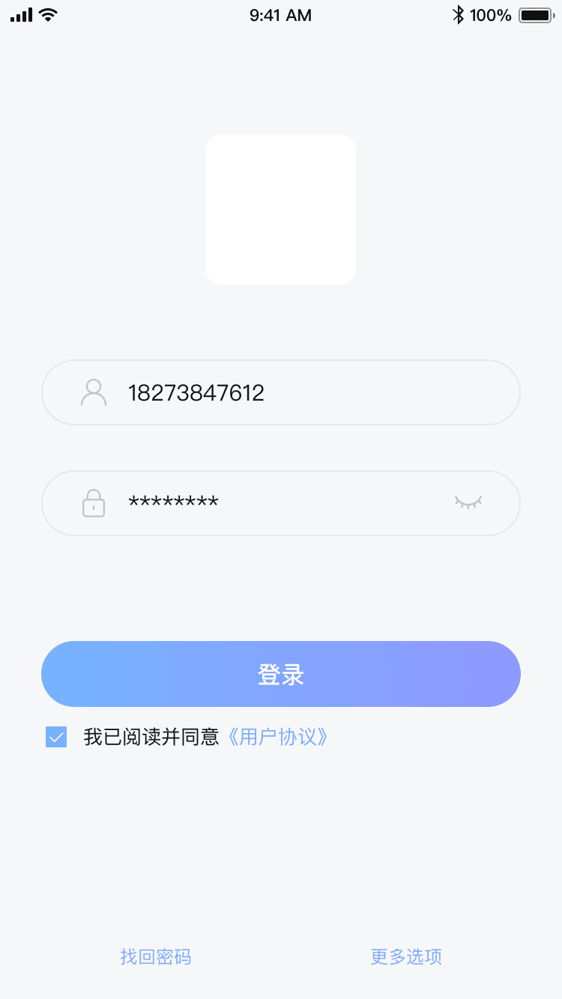
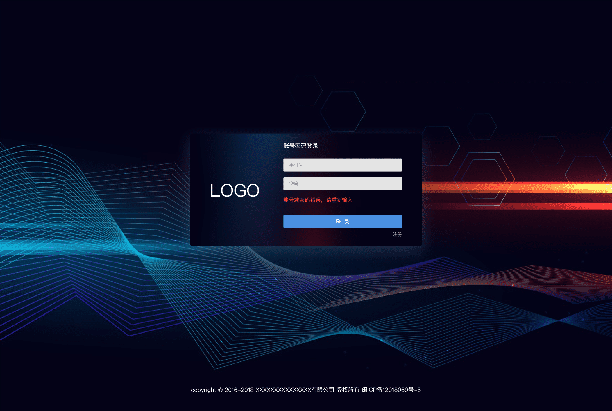
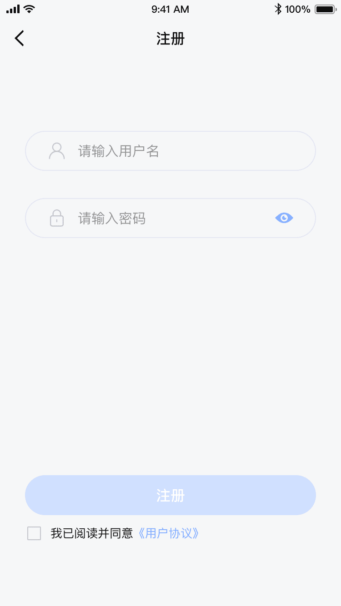
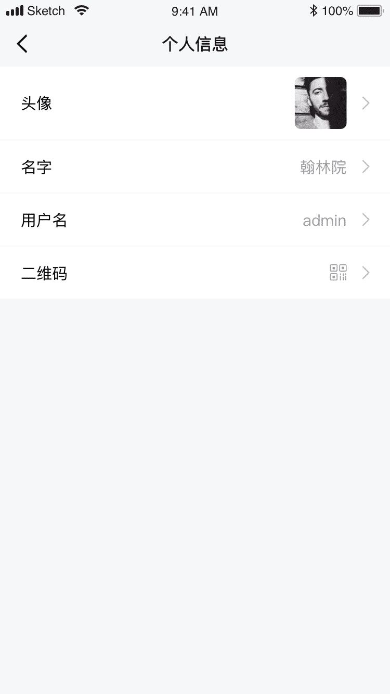
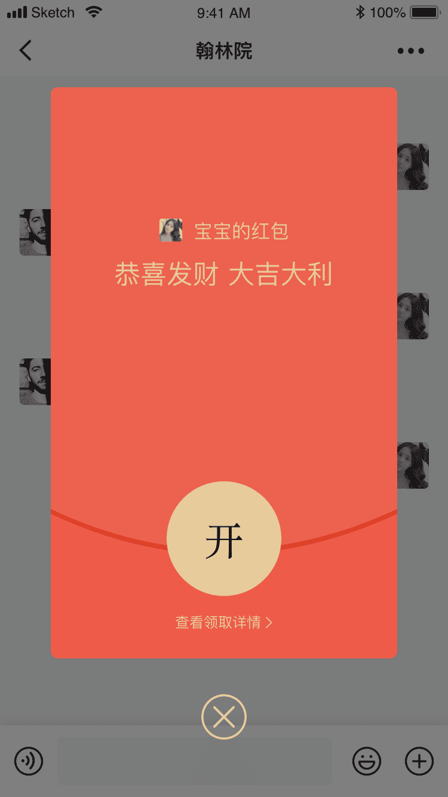
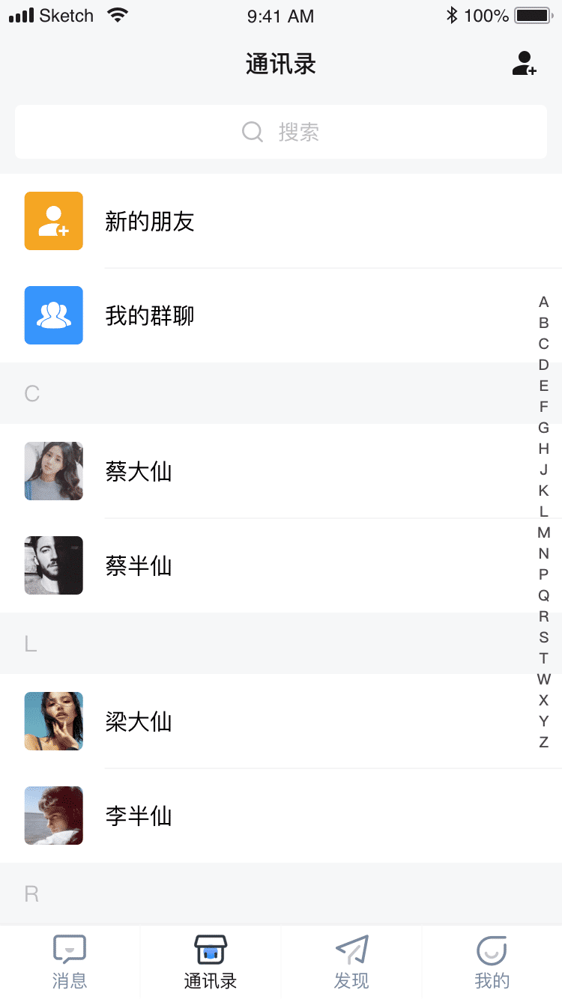
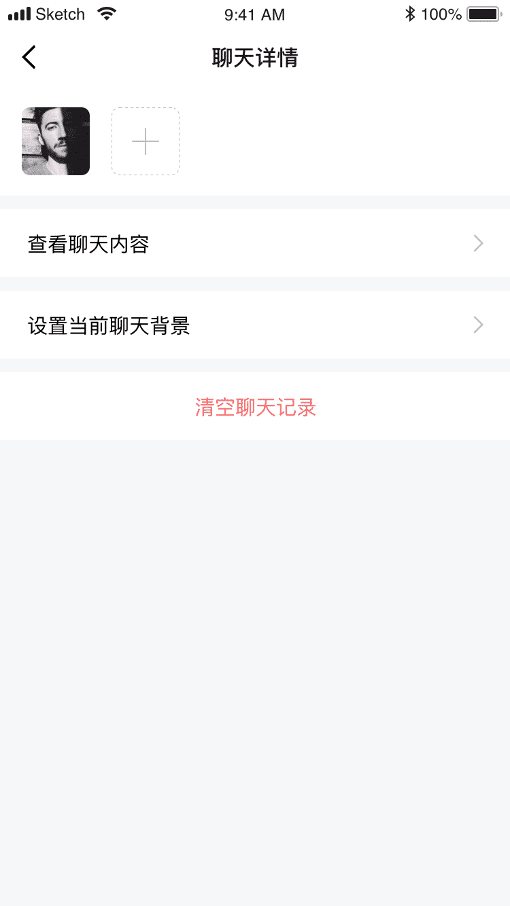
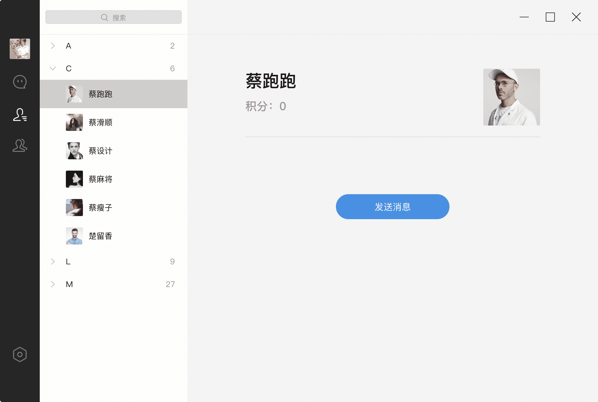

# 易群1.0

#### 官网
[https://bzghost.com](https://bzghost.com) 

>打造一款跨平台即时通信软件

>个人也能玩得转的IM

#### 目录

- uni-app 可以发布app版本
- vue-admin 后台管理系统
- vue-pc 可以发布pc版
- vue-h5 原始的老版本h5 目前已经改用uni-app 不建议使用
- java代码 联系作者有偿获取

#### 感谢
- `https://gitee.com/lele-666/V-IM.git` 
- `https://gitee.com/xiaowang0482/wechat.git`
- `https://github.com/mengjava/easy-im.git`
#### 联系
`QQ群 1025293030 
微信 18767176707`

#### 功能
- 消息类型
- [x] 群红包 
- [x] 文件
- [x] 图片 
- [x] 语音 
- [x] 视频 
- [x] 表情 
- [x] 撤回 
- [x] 转发 
- [x] @功能
- [x] 禁言

#### 技术
1. webscoket
1. vue
1. uniapp 
1. uView
1. electron-vue
1. iVew

#### 地址

> 账号：admin

> 密码：123456

> 账号：test1

> 密码：123456

后台: [后台 地址](http://120.27.95.106/index.html) 

PC : [EXE 下载](http://39.100.14.171/yiqun2.exe)

APP: [APK 下载](http://39.100.14.171/yiqun2.apk)

MAC H5 Linux: 暂未发布 

#### 图片展示

  
  

  
  
  

