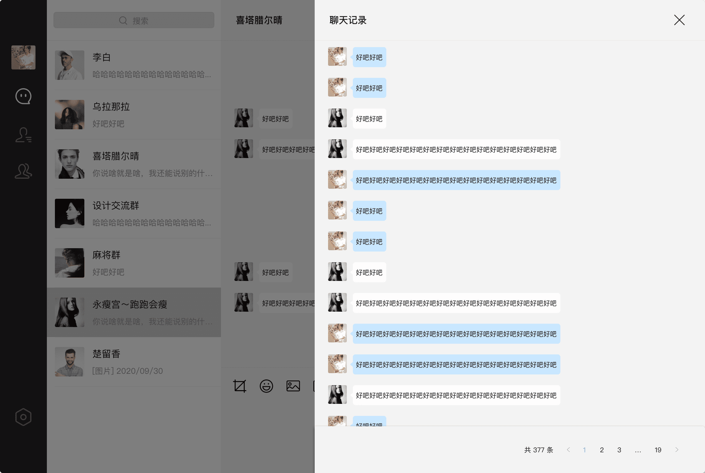

# 易群1.0

#### 官网
[http://120.27.95.106](http://120.27.95.106/index.html) 

你是个人开发者嘛 技术太多太复杂 是不是困扰着你 老板要做聊天软件没有思路 这些我们都替你想好了 我们致力于打造一款跨平台即时通信聊天软件，个人也能玩得转的IM 。 vue 编写所有端 安卓 ios mac window linux h5 web 全部都支持 是不是很强悍。

#### 展示

#### 教程

下载HBuilder工具导入 vue-app代码首先进入vue-app 根目录下载插件 npm i

之后预览网页h5 也可以运行手机上测试

vup-admin vue-pc 都是npm i
 npm run dev

#### 目录

- 1.  vue-app代码 苹果 安卓 h5 我们免费
- 2.  vue-pc代码 window linux mac 我们免费
- 3.  vue-admin web管理界面 我们免费
- 4.  api 接口代码 联系作者有偿获取

#### 感谢
- `https://gitee.com/lele-666/V-IM.git` 
- `https://gitee.com/xiaowang0482/wechat.git`
- `https://gitee.com/crazymaker/crazy_tourist_circle__im.git`

参考实战Netty集群 - CrazyIM 分布式聊天实战
#### 联系
`QQ群 1025293030 
微信 18767176707`

#### 功能
- 消息类型
- [x] 群红包 
- [x] 文件
- [x] 图片 
- [x] 语音 
- [x] 视频 
- [x] 表情 
- [x] 撤回 
- [x] 转发 
- [x] @功能
- [x] 禁言

#### 技术
1. webscoket
1. vue
1. uniapp 
1. uView
1. electron-vue
1. iVew

#### 地址

> 账号：admin

> 密码：123456

> 账号：test1

> 密码：123456

后台: [后台 地址](http://120.27.95.106/index.html) 

PC : [EXE 下载](http://120.27.95.106/yiqun_pc_1.0.0.exe)

APP: [APK 下载](http://120.27.95.106/yiqun_android_1.0.0.apk)

IOS: [IPA 下载](http://120.27.95.106/yiqun_ios_1.0.0.ipa)

H5 Linux: 暂未发布 

